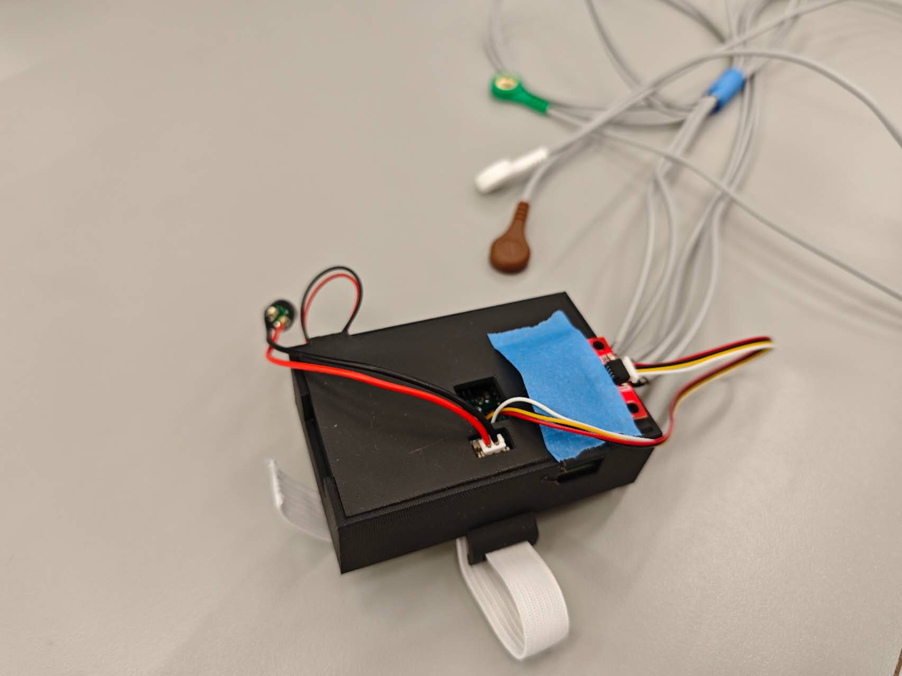
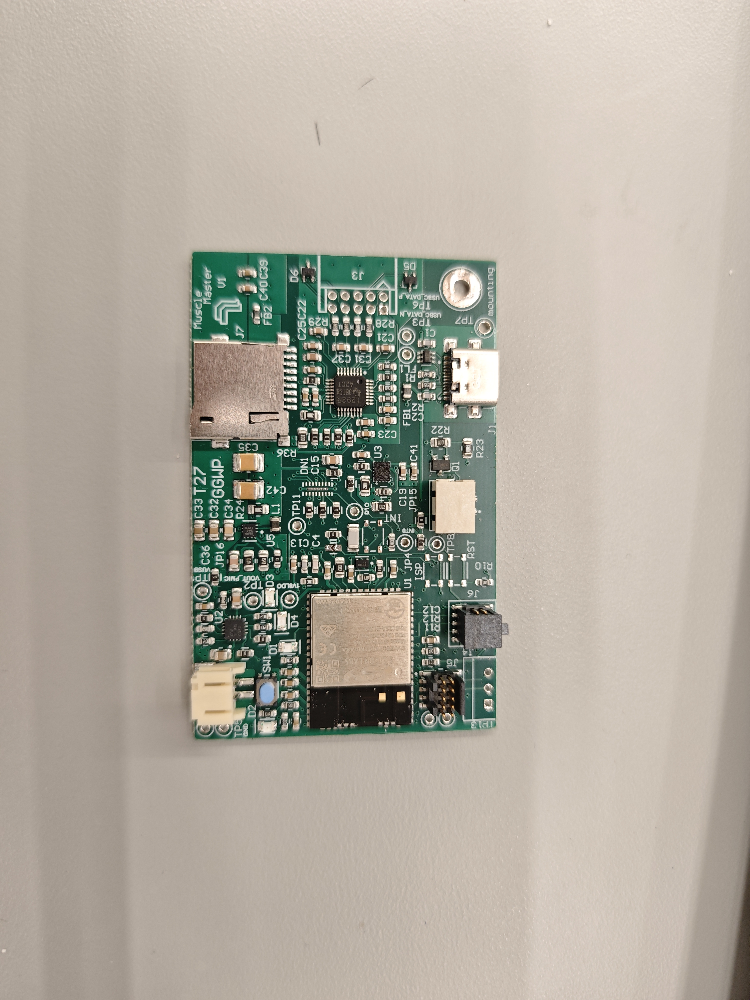
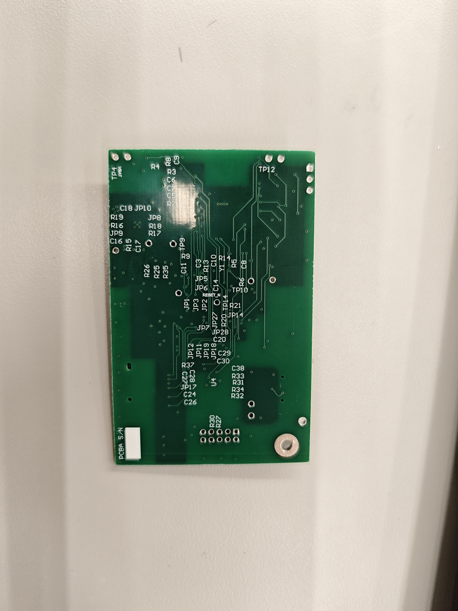
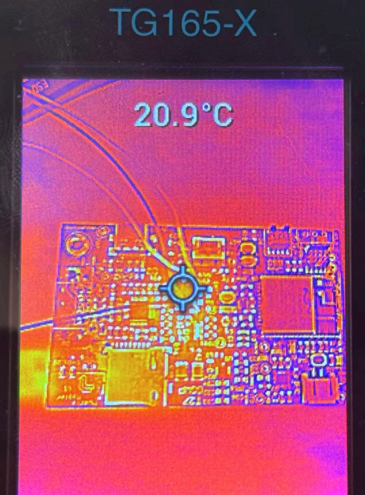
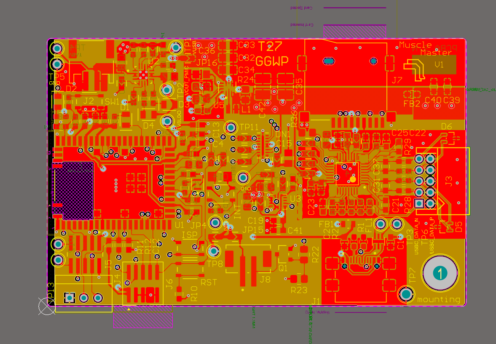
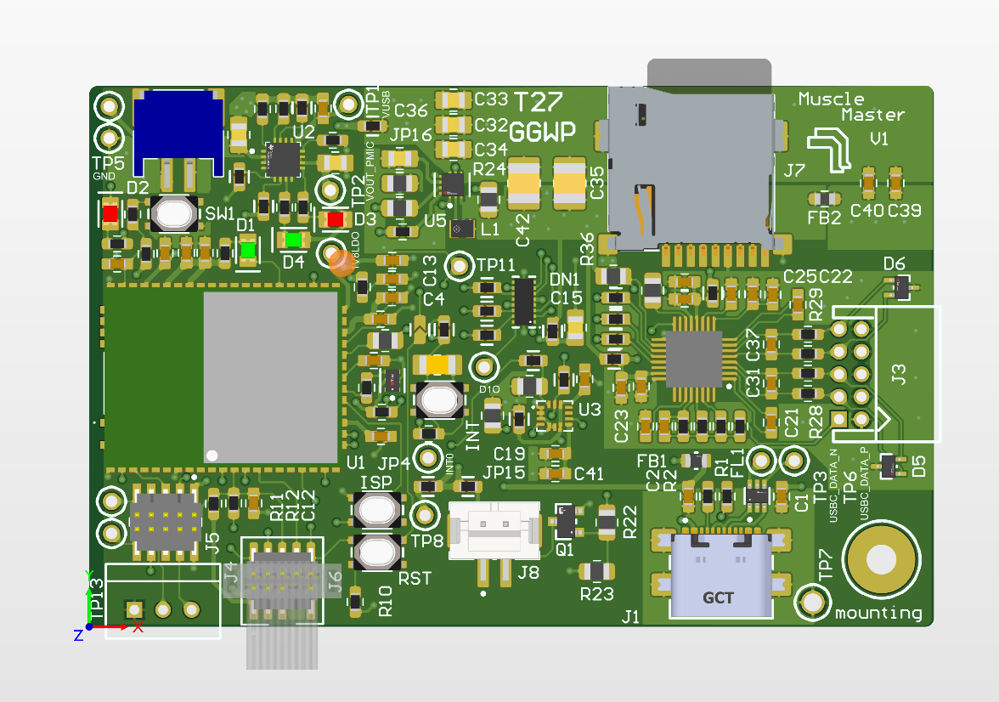
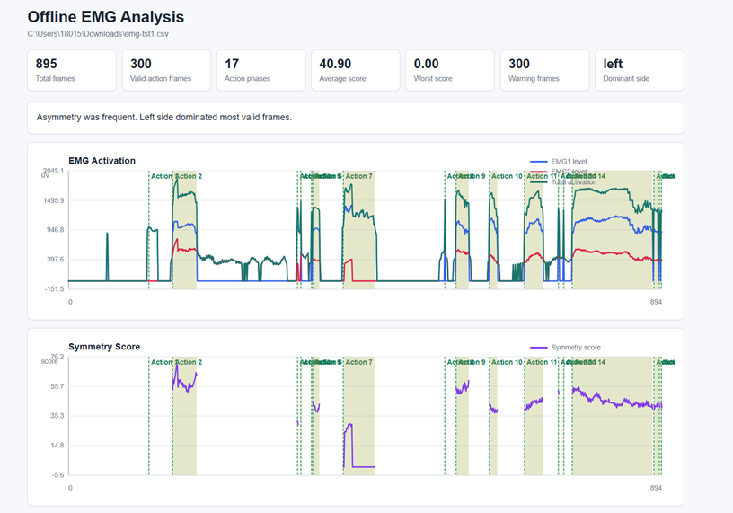
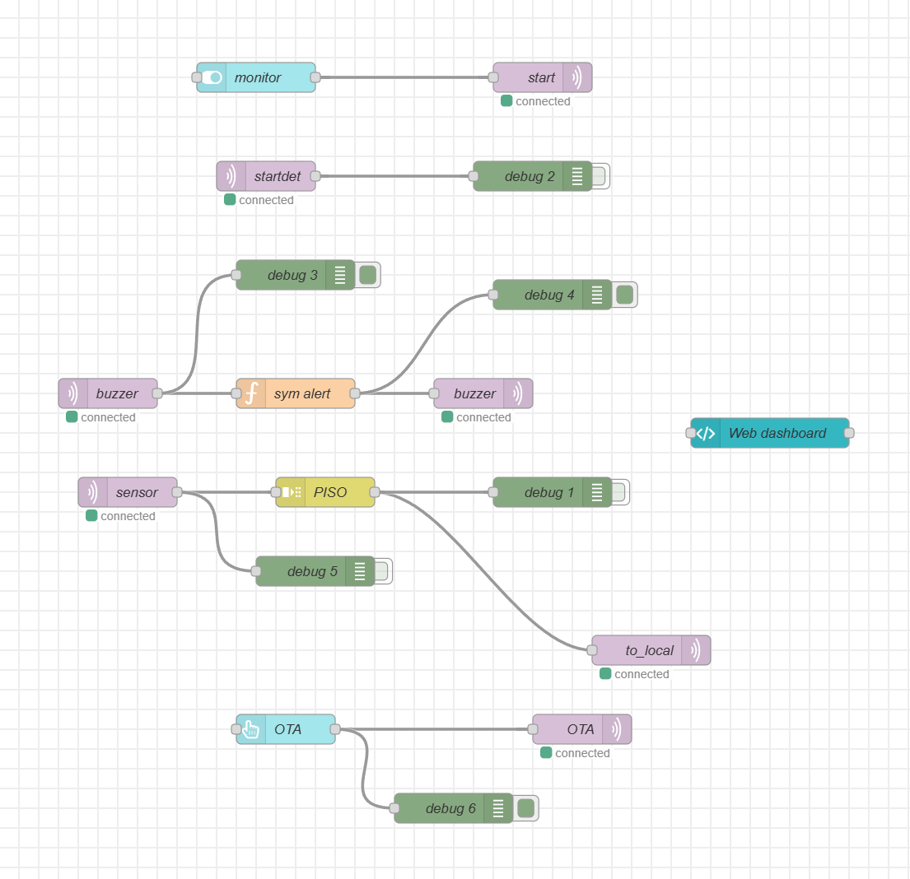
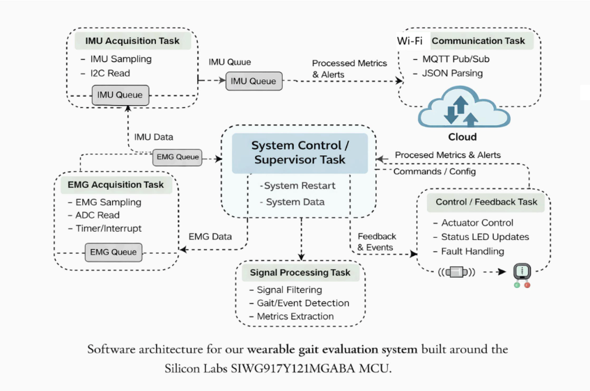

[](https://classroom.github.com/a/Y5lYn2wb)

# a11g-final-submission

**Team Number: T27**

**Team Name: GGWP**

| Team Member Name | Email Address          | GitHub Username |
| ---------------- | ---------------------- | --------------- |
| Shunyao Jiang    | jiang24@seas.upenn.edu | jiang24-2025    |
| Sirui Wu         | wu40@seas.upenn.edu    | wu40-cmd        |

**GitHub Repository URL:**

## 1. Video Presentation

[https://youtu.be/CxcoiCnaHWc]()

[https://youtu.be/yFwJjuu4n1c]()

## 2. Project Summary

### Device Description

Our device is a wearable gait and muscle-activity evaluation system designed for lower-leg and ankle rehabilitation. It uses an IMU and surface EMG sensing to monitor walking motion, muscle activation, and possible gait asymmetry in real time.

This project was inspired by the difficulty of detecting incorrect muscle compensation during home-based rehabilitation. During recovery, users may be able to see their joint movement, but they usually cannot tell whether the correct muscles are being activated. Our device helps solve this problem by providing objective motion and muscle-activity feedback during rehabilitation exercises.

The Internet augments the device by allowing processed gait and muscle-activity metrics to be transmitted to a Node-RED dashboard. Instead of only storing or displaying raw sensor data locally, the system visualizes useful information such as motion trends, EMG activity, system status, and feedback alerts through a cloud-connected interface.

---

### Device Functionality

The device is designed as an Internet-connected wearable sensing system. The wearable PCB collects motion and muscle-activity data from the user, processes the signals on the SIWG917 MCU, and sends meaningful information to the Node-RED dashboard through wireless communication.

The main components of the system include:

- **Silicon Labs SIWG917 MCU**: Main embedded controller and wireless communication unit.
- **IMU Sensor**: Measures lower-leg motion and supports gait event detection.
- **ADS1291 / EMG Sensing Front-End**: Collects surface EMG signals from external electrodes to measure muscle activation.
- **Buzzer**: Provides feedback when abnormal movement or gait asymmetry is detected.
- **Status LEDs**: Indicate power, wireless connection, calibration, and system state.
- **Single-Cell Li-ion Battery**: Supports portable wearable operation.
- **Node-RED Dashboard on Azure VM**: Displays real-time sensor data, processed gait metrics, system status, alerts, and user controls.

The system-level design is shown below:

```text
User Lower Leg / Ankle
        |
        v
+-----------------------------+
| Wearable Sensors            |
| - IMU                       |
| - EMG Electrodes            |
+-------------+---------------+
              |
              v
+-----------------------------+
| Custom Wearable PCB         |
| - SIWG917 MCU               |
| - ADS1291 EMG Front-End     |
| - Power Management          |
| - Status LEDs               |
| - Vibration Motor Driver    |
+-------------+---------------+
              |
              v
+-----------------------------+
| Embedded Firmware           |
| - Sensor Acquisition        |
| - EMG Sampling              |
| - IMU Data Processing       |
| - Filtering                 |
| - Gait Event Detection      |
| - Muscle Activation Check   |
| - Feedback Decision Logic   |
+-------------+---------------+
              |
              v
+-----------------------------+
| Wireless Communication      |
| - Wi-Fi                     |
| - MQTT                      |
+-------------+---------------+
              |
              v
+-----------------------------+
| Node-RED Dashboard          |
| - Real-Time Graphs          |
| - EMG Activity Display      |
| - Motion / Gait Metrics     |
| - Device Status             |
| - Alert Display             |
| - User Controls             |
+-------------+---------------+
              |
              v
+-----------------------------+
| User Feedback               |
| - Dashboard Feedback        |
| - Haptic Vibration Feedback |
+-----------------------------+
```

### Challenges

One major challenge was integrating the EMG sensing subsystem with the MCU. EMG signals are very small and sensitive to noise, so stable electrode contact, wiring, filtering, grounding, and sampling timing were all important for collecting usable data.

Another challenge was configuring embedded peripherals on the SIWG917 platform. Interfaces such as I2C, SPI, GPIO, interrupts, timers, and wireless communication required careful setup and testing. Small configuration errors could cause sensor read failures, unstable sampling, or incorrect data formatting.

We also faced challenges during full-system integration. Individual modules such as the IMU, EMG front-end, LEDs, vibration motor, and Node-RED dashboard could be tested separately, but combining them into one complete workflow required debugging timing, data format, communication, and firmware logic issues.

Wireless communication and dashboard integration were also important challenges. The device needed to publish meaningful data to the cloud instead of only sending raw values. The Node-RED dashboard had to display information clearly so that the user could understand the system status and rehabilitation feedback.

We overcame these challenges by dividing the system into smaller modules and testing each part independently before integration. We used simple test firmware, serial debugging, oscilloscope or logic analyzer checks, MQTT test messages, and Node-RED simulations to verify each subsystem step by step.

---

### Prototype Learnings

Through this prototype, we learned that building an IoT device is not only about collecting sensor data. A complete IoT system must combine hardware design, embedded firmware, signal processing, wireless communication, cloud visualization, and user-facing feedback.

We also learned the importance of requirement validation. Sensor sampling rate, signal quality, wireless data transfer, actuator response, power behavior, and dashboard functionality all need to be tested with real measurements instead of only being assumed from the design.

Another lesson was that wearable devices must be designed around the user. Sensor placement, electrode contact, comfort, wiring, battery operation, and simple feedback are just as important as the embedded hardware and software implementation.

We also learned that integration should begin as early as possible. Even if each subsystem works individually, unexpected problems can appear when sensors, firmware, wireless communication, and the dashboard operate together.

If we built this device again, we would improve the mechanical enclosure and electrode mounting earlier in the project. We would also add more PCB test points, simplify the sensor connection layout, improve cable management, and create a more automated data-processing pipeline for EMG and gait analysis.

---

### Next Steps & Takeaways

The next step is to improve the reliability of the EMG signal and perform more structured validation with repeated walking or rehabilitation trials. More data should be collected from different users and movement conditions to better distinguish normal gait from compensation, asymmetry, or abnormal muscle activation.

We would also improve the Node-RED dashboard by adding clearer session summaries, long-term progress tracking, and more user-friendly feedback. In a future version, the system could provide personalized thresholds and rehabilitation suggestions based on each user’s history.

Additional hardware improvements could include a smaller wearable enclosure, better electrode connectors, improved battery management, more secure sensor mounting, and more robust wireless communication.

Through ESE5160, we learned how to take an IoT device from concept to prototype. The course helped us understand the full design process, including requirement definition, PCB design, embedded driver development, sensor integration, cloud communication, Node-RED visualization, debugging, and final system validation.

The most important takeaway is that real IoT systems require careful integration across many layers. Hardware, firmware, networking, cloud software, and user experience must all work together for the final device to be useful.

---

### Project Links

- Node-RED Dashboard URL: http://52.242.121.159:1880/dashboard/page1
- Final PCBA Altium 365 Share Link: https://upenn-eselabs.365.altium.com/designs/45A8C8D4-1D48-49A9-82AC-4104ED8014D1#design
- Final Firmware Repository: https://github.com/ese5160/final-project-firmware-s26-t27-ggwp.git

## 3. Hardware & Software Requirements

This section reviews the hardware and software requirements defined earlier in the semester. Each requirement was checked through prototype testing, subsystem testing, or full-system integration testing. Some requirements were fully met, while others were partially met because the prototype worked at the subsystem level but still needs more complete validation under repeated walking trials.

---

### 3.1 Hardware Requirements Review

| ID     | Requirement                                                                                                                                                                  | Status        | Validation Method                                                                       | Result / Evidence                                                                                                                                                |
| ------ | ---------------------------------------------------------------------------------------------------------------------------------------------------------------------------- | ------------- | --------------------------------------------------------------------------------------- | ---------------------------------------------------------------------------------------------------------------------------------------------------------------- |
| HRS-01 | The device shall use the Silicon Labs SIWG917Y121MGABA as the primary microcontroller and wireless communication IC.                                                         | Met           | Checked final PCB design and firmware target platform.                                  | The SIWG917 was used as the main MCU for embedded control and wireless communication.                                                                            |
| HRS-02 | An IMU shall be used to measure lower-leg motion and communicate with the MCU through I2C.                                                                                   | Met           | Verified IMU connection in hardware design and tested I2C communication using firmware. | The MCU was able to communicate with the IMU over I2C and collect motion-related data.                                                                           |
| HRS-03 | A surface EMG sensing subsystem shall be used to measure lower-leg muscle activation using external electrodes.                                                              | Partially Met | Tested EMG front-end connection and observed EMG signal response with electrode input.  | The EMG subsystem was included and tested, but signal quality was sensitive to electrode placement, wiring, and noise. More filtering and validation are needed. |
| HRS-04 | The EMG sensing subsystem shall provide a DRDY interrupt or equivalent timing reference to verify an effective sampling rate of at least 800 samples per second per channel. | Partially Met | Checked EMG data-ready behavior and firmware sampling logic.                            | The design supports timing-based EMG sampling, but the final prototype still requires more complete measurement of long-duration sampling stability.             |
| HRS-05 | At least one vibration motor shall be included as an actuator to provide haptic feedback when gait asymmetry is detected.                                                    | Met           | Tested GPIO/PWM motor control from firmware.                                            | The vibration motor was included as the actuator and could be activated by the MCU.                                                                              |
| HRS-06 | Status LEDs shall be included to indicate system states including power, wireless connectivity, and calibration.                                                             | Met           | Tested LED control through GPIO firmware.                                               | Status LEDs were included and used to indicate device/system states.                                                                                             |
| HRS-07 | The device shall operate from a single-cell Li-ion battery with a nominal voltage of 3.7 V.                                                                                  | Met           | Checked power architecture and battery input design.                                    | The system was designed around a single-cell Li-ion battery power input.                                                                                         |
| HRS-08 | The total cost of sensors and actuators shall not exceed approximately $30 per PCB assembly.                                                                                 | Met           | Reviewed selected sensor and actuator component costs.                                  | The selected IMU, EMG front-end, vibration motor, and LEDs were chosen to remain within the course budget target.                                                |

---

### 3.2 Hardware Validation Testing

#### MCU and Peripheral Validation

The SIWG917 MCU was validated by programming firmware through the development environment and testing basic peripheral functions. GPIO outputs were first tested with LEDs, and then additional peripherals such as I2C and actuator control were tested separately.

**Test Result:**
The MCU successfully controlled GPIO outputs and supported communication with external components. This confirmed that the SIWG917 could act as the central controller for the prototype.

---

#### IMU Validation

The IMU was tested through the I2C interface. The firmware attempted to initialize the IMU, read sensor registers, and collect motion data. A successful I2C response confirmed that the MCU could communicate with the motion sensor.

**Test Result:**
The IMU communication requirement was met. The device was able to read motion-related data through I2C, which supports lower-leg motion monitoring and future gait event detection.

---

#### EMG Subsystem Validation

The EMG sensing subsystem was tested using external electrodes and the analog/front-end signal path. During testing, the EMG signal changed when muscle activity or electrode contact changed, showing that the subsystem could respond to biological signal input.

However, EMG signals were much more sensitive to noise than the IMU signal. Electrode placement, grounding, cable movement, and filtering had a major effect on the quality of the collected signal.

**Test Result:**
The EMG subsystem was partially validated. The prototype included the EMG sensing hardware and could observe signal changes, but more structured testing is needed to confirm stable and repeatable EMG acquisition during walking.

---

#### Buzzer Validation

The buzzer was tested by controlling it through the MCU. The firmware activated the buzzer as a feedback output, simulating the response that would occur when gait asymmetry or abnormal muscle activation is detected.

**Test Result:**
The actuator requirement was met. The buzzer could be controlled by the MCU and used as audio feedback.

---

#### Status LED Validation

The status LEDs were tested using GPIO output control. LEDs were used to indicate different system states such as power, connection, or test mode.

**Test Result:**
The LED requirement was met. The MCU successfully controlled the status LEDs.

---

#### Power Validation

The prototype was designed to operate from a single-cell Li-ion battery with a nominal voltage of 3.7 V. The power architecture was checked against the course requirement for portable battery-powered operation.

**Test Result:**
The power requirement was met at the design level. The system was designed for single-cell Li-ion battery operation, but future work should include longer battery-life testing under continuous sensing and wireless communication.

---

### 3.3 Software Requirements Review

| ID     | Requirement                                                                                                                             | Status        | Validation Method                                            | Result / Evidence                                                                                                                            |
| ------ | --------------------------------------------------------------------------------------------------------------------------------------- | ------------- | ------------------------------------------------------------ | -------------------------------------------------------------------------------------------------------------------------------------------- |
| SRS-01 | The system shall execute all firmware tasks on the Silicon Labs SIWG917Y121MGABA MCU.                                                   | Met           | Checked firmware target and execution platform.              | Firmware was developed for the SIWG917 MCU.                                                                                                  |
| SRS-02 | The system shall read lower-leg motion data from the IMU through I2C and process it to estimate gait motion.                            | Met           | Tested I2C sensor communication and basic data reading.      | IMU data could be collected through I2C. Basic processing was implemented or prepared for gait-related analysis.                             |
| SRS-03 | The system shall acquire EMG data from the EMG sensing subsystem for lower-leg muscle activity monitoring.                              | Partially Met | Tested EMG subsystem signal acquisition.                     | EMG signal acquisition was implemented, but signal quality still needs more filtering and repeated validation.                               |
| SRS-04 | The system shall sample EMG data at a rate compatible with the hardware configuration to support step-level muscle activation analysis. | Partially Met | Checked firmware sampling logic and timing behavior.         | Sampling logic was developed, but the final system still needs more complete verification of stable sampling rate over long sessions.        |
| SRS-05 | The system shall analyze synchronized IMU and EMG data to detect gait asymmetry or abnormal movement patterns.                          | Partially Met | Tested sensor data paths and processing logic.               | Basic logic was developed, but full synchronized gait-asymmetry detection requires more real walking data and calibration.                   |
| SRS-06 | Upon detection of gait asymmetry, the system shall activate the vibration motor to provide haptic feedback to the user.                 | Partially Met | Tested motor activation through firmware and feedback logic. | The vibration motor could be controlled by firmware. Full closed-loop activation based on validated gait asymmetry still needs more testing. |
| SRS-07 | The system shall control status LEDs to indicate power state, wireless connectivity, and calibration status.                            | Met           | Tested LED GPIO control.                                     | Firmware successfully controlled LEDs for system status indication.                                                                          |
| SRS-08 | The system shall manage power consumption to support battery-powered operation from a single-cell Li-ion battery.                       | Partially Met | Reviewed power design and firmware operation.                | The hardware supports battery-powered operation, but detailed low-power firmware optimization and battery-life testing remain future work.   |

---

### 3.4 Software Validation Testing

#### Firmware Execution

The firmware was built and tested for the SIWG917 platform. Basic firmware execution was confirmed by programming the MCU and testing simple output behavior such as LEDs and serial/debug messages.

**Test Result:**
The firmware execution requirement was met. The SIWG917 successfully ran the prototype firmware.

---

#### Sensor Data Acquisition

The IMU and EMG subsystems were tested separately before integration. The IMU was tested through I2C communication, while the EMG subsystem was tested by observing changes in the collected signal during electrode contact and muscle activity.

**Test Result:**
The IMU data path was successfully validated. The EMG data path was partially validated, but additional filtering and controlled experiments are needed to improve repeatability.

---

#### Signal Processing and Gait Evaluation

The system was designed to process IMU and EMG data to support gait-event detection, muscle-activation analysis, and asymmetry evaluation. The prototype demonstrated the required data paths and basic processing structure, but the final gait classification still requires more real user data.

**Test Result:**
This requirement was partially met. The system architecture supports gait evaluation, but full validation requires repeated walking trials and comparison between normal and abnormal gait patterns.

---

#### Wireless Communication and Node-RED Dashboard

The cloud side of the system was implemented using Node-RED. MQTT test messages were used to simulate device data and verify that the dashboard could display system information, graphs, alerts, and user controls.

**Test Result:**
The Node-RED dashboard was validated using test data. Full validation with continuous real-time data from the wearable device is still a future improvement.

---

#### Feedback Output

The vibration motor and LEDs were tested as output devices. The firmware could activate the vibration motor and change LED states.

**Test Result:**
The feedback output hardware and firmware control were validated. The next step is to connect the feedback behavior more tightly to validated gait-asymmetry detection.

---

### 3.5 Summary of Requirement Completion

Overall, the prototype successfully met the main hardware platform, IMU sensing, actuator, LED, and system architecture requirements. The most complete parts of the prototype were the MCU platform, basic peripheral control, IMU communication, actuator output, and Node-RED dashboard structure.

The requirements that were only partially met were mainly related to EMG signal quality, long-duration sampling validation, synchronized IMU/EMG gait analysis, and closed-loop feedback based on fully validated gait detection. These parts are more sensitive to noise, timing, electrode placement, and real user testing.

The final prototype demonstrates the core idea of an Internet-connected wearable rehabilitation monitoring device. Future work should focus on improving EMG reliability, collecting more walking data, validating gait-asymmetry detection, and refining the dashboard for clearer rehabilitation feedback.

## 4. Project Photos & Screenshots

This section includes photos and screenshots of our final prototype, PCB design, thermal testing, Node-RED system, and updated system block diagram.

---

### 4.1 Final Project Prototype

**Description:**
Final assembled wearable rehabilitation monitoring prototype, including the PCB, sensors, actuator, wiring, and any casework or mounting elements.



---

### 4.2 Standalone PCBA - Top View

**Description:**
Top view of the final assembled PCBA.



### 4.3 Standalone PCBA - Bottom View

**Description:**
Bottom view of the final assembled PCBA.



---

### 4.4 Thermal Camera Image Under Load

**Description:**
Thermal camera image of the board running under load.



---

### 4.5 Altium Board Design - 2D View

**Description:**
Screenshot of the final PCB layout in Altium 2D view.



---

### 4.6 Altium Board Design - 3D View

**Description:**
Screenshot of the final PCB model in Altium 3D view.



---

### 4.7 Node-RED Dashboard

**Description:**
Screenshot of the Node-RED dashboard showing real-time sensor data, system status, alerts, and user controls.



---

### 4.8 Node-RED Backend

**Description:**
Screenshot of the Node-RED backend flow, including MQTT input/output, data processing, dashboard nodes, and control logic.



---

### 4.9 Updated System Block Diagram

**Description:**
Updated system-level block diagram showing the final design architecture and data flow.



## 5. Codebase

Do *not* commit any of your source code to this repository. Rather, provide links to the other GitHub repository you've already been using with your firmware.

- A link to your final embedded C firmware codebases
  [https://github.com/ese5160/final-project-firmware-s26-t27-ggwp.git]()
- A link to your Node-RED dashboard code
  [https://github.com/ese5160/final-project-firmware-s26-t27-ggwp.git]()
- Links to any other software required for the functionality of your device
  [https://github.com/ese5160/final-project-firmware-s26-t27-ggwp.git]()
